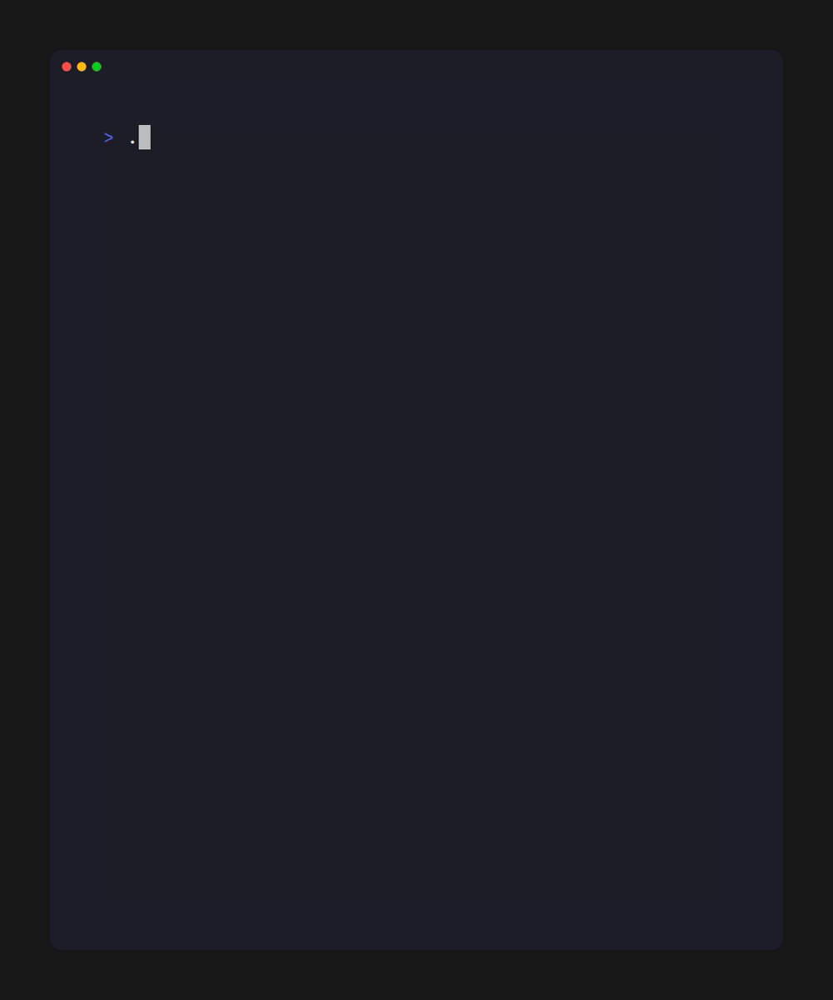

# 🎮 Number Guessing Game
A fun and interactive command-line number guessing game written in C with intelligent proximity hints and multiple difficulty levels!



## ✨ Features
- **Three Difficulty Levels**
  - 🟢 Easy: Guess numbers between 0-50
  - 🟡 Medium: Guess numbers between 0-100
  - 🔴 Hard: Guess numbers between 0-500

- **Smart Proximity Hints**
  - Dynamic feedback based on how close you are to the answer
  - Five levels of hints: "Super close", "Very close", "Getting warm", "Somewhat far", and "Way off"
  - Hints scale proportionally with the difficulty level

- **User-Friendly Design**
  - Input validation to handle invalid entries
  - Range checking to keep guesses within bounds
  - Try counter to track your performance
  - Option to play multiple rounds

## 🎓 What I Learned

Building this project helped me understand several important C programming concepts:

- **Random Number Generation**: Using `rand()` and `srand(time(NULL))` to generate unpredictable numbers for each game session
- **Input Validation**: Handling invalid user inputs gracefully and preventing program crashes from non-numeric entries
- **Algorithm Design**: Creating a dynamic proximity hint system that scales with difficulty using percentage-based thresholds (2%, 5%, 10%, 20% of range)
- **Control Flow**: Implementing game loops with replay functionality and difficulty selection menus
- **User Experience**: Designing clear feedback messages and intuitive command-line interfaces that guide players effectively
- **Range Management**: Working with different number ranges and adjusting game logic to maintain consistent difficulty across levels
- **Code Organization**: Structuring a complete program with multiple features, making it maintainable and easy to understand

This project taught me that good programming isn't just about making code work—it's about making it user-friendly, robust, and well-documented.

## 🚀 Getting Started

### Prerequisites
- GCC compiler (or any C compiler)
- Terminal/Command prompt

### Compilation
```bash
gcc game.c -o number_game
```

### Running the Game
```bash
./number_game
```

On Windows:
```bash
number_game.exe
```

## 🎯 How to Play
1. Launch the game and select your difficulty level (1-3)
2. The game will generate a random number within the chosen range
3. Enter your guesses and follow the proximity hints
4. Keep guessing until you find the correct number!
5. Choose whether to play again or exit

## 🛠️ Technical Details
- **Language:** C
- **Random Number Generation:** Uses `rand()` seeded with current time
- **Input Handling:** Robust error checking for non-numeric inputs
- **Hint Algorithm:** Dynamic thresholds based on the number range (2%, 5%, 10%, 20% of range)

## 🎲 Difficulty Settings
| Level | Range | Ideal Tries |
|-------|-------|-------------|
| Easy | 0-50 | 6-8 |
| Medium | 0-100 | 7-10 |
| Hard | 0-500 | 9-12 |

## 🤝 Contributing
Feel free to fork this project and add your own features! Some ideas:
- Add a score system
- Implement a limited tries mode
- Add sound effects
- Create a high score leaderboard

## 📝 License
This project is free to use and modify for personal and educational purposes.

## 👨‍💻 Author
Created with ❤️ as a fun C programming exercise

**Repository:** [github.com/vivekwaldia/c-number-guessing-game](https://github.com/vivekwaldia/c-number-guessing-game)

---
**Enjoy the game and happy guessing!** 🎉
